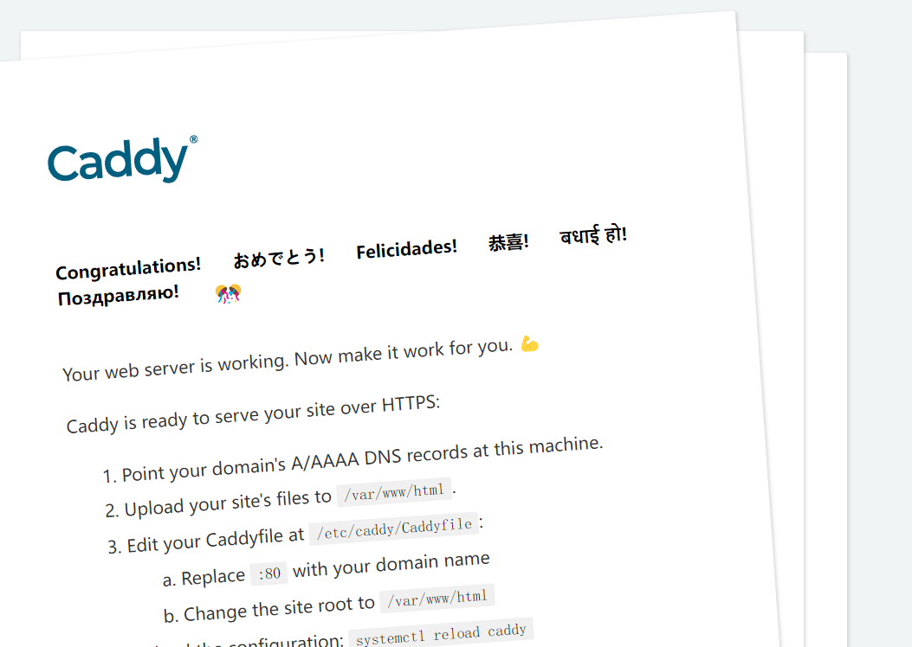
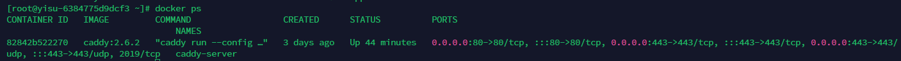
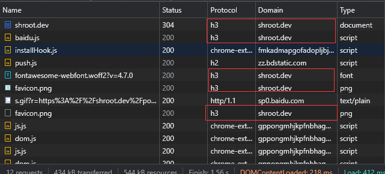
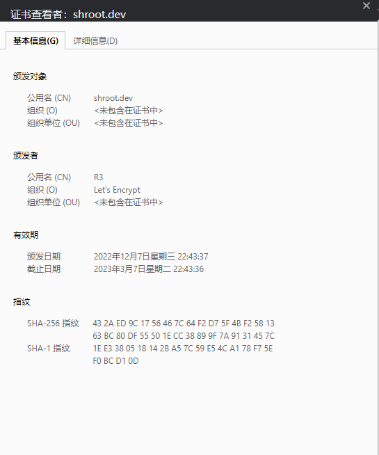

## 使用背景
发现Caddy是我刚刚将博客换了个服务器，一时兴起，听闻IETF已经在今年(22年6月)推出了正式版[HTTP3(RFC9114)](https://datatracker.ietf.org/doc/html/rfc9114),那就干脆使得博客支持上，但找了半天，基于nginx都没有一个简单的方案，都是要去编译`nginx-quic`然后修改配置文件,看着就感觉好麻烦，也没有找到合适的docker来支持，弄完还得去弄证书来开启`https`。偶然间又看到一篇文章[利用Caddy轻松HTTPS，支持HTTP3/QUIC](https://blog.csdn.net/wyyyh9458/article/details/121178999),然后查了一下，发现`caddy`这个web服务器已经是`默认支持HTTP3`了，而且还可以自动去生成`TLS`证书，自动开启`https`，官方支持docker，那不快乐起来了吗！

## 简介
[Caddy](https://caddyserver.com/)是一款用Golang编写的开源的web服务器，相比于Nginx来说有着以下优点
1. 可自动获取TLS证书
2. 自动续签证书
3. 默认支持HTTP3(RFC9114)协议
4. 配置文件简单易上手

## docker-compose.yml
```yml
version: "3.7"

services:
  caddy:
    container_name: caddy-server
    image: caddy:2.6.2
    restart: always
    ports:
      - "80:80"
      - "443:443"
      - "443:443/udp"
    volumes:
      - $PWD/Caddyfile:/etc/caddy/Caddyfile
      - $PWD/site:/srv
      - $PWD/caddy_data:/data
      - $PWD/caddy_config:/config
```

## 创建一些映射出来的文件和文件夹
在`docker-compose.yml`同目录下
```sh
mkdir site
mkdir caddy_data
mkdir caddy_config
touch Caddyfile
```
编辑`Caddyfile`(当然，也可以启动docker容器后copy出来)
```txt
# The Caddyfile is an easy way to configure your Caddy web server.
#
# Unless the file starts with a global options block, the first
# uncommented line is always the address of your site.
#
# To use your own domain name (with automatic HTTPS), first make
# sure your domain's A/AAAA DNS records are properly pointed to
# this machine's public IP, then replace ":80" below with your
# domain name.

:80 {
        # Set this path to your site's directory.
        root * /usr/share/caddy

        # Enable the static file server.
        file_server

        # Another common task is to set up a reverse proxy:
        # reverse_proxy localhost:8080

        # Or serve a PHP site through php-fpm:
        # php_fastcgi localhost:9000
}

shroot.dev {
        root * /srv/shroot.dev
        encode gzip zstd
        file_server
}

www.shroot.dev {
        redir https://shroot.dev/{uri}
}
# Refer to the Caddy docs for more information:
# https://caddyserver.com/docs/caddyfile
```
简单说下配置文件  
- `:80` 是caddy自带的一个页面,如下图  
  
- `shroot.dev` 是我的域名，当然，`:80`也是域名,从[文档](https://caddyserver.com/docs/caddyfile/concepts#addresses)来看，`Caddy`对域名的格式要求并不严格  
- `root * /srv/shroot.dev` 是网站根目录指向的`/srv/shroot.dev`这个路径，`*`是站点匹配路径,可以参考[文档](https://caddyserver.com/docs/caddyfile/directives/root#root),注意这个路径是docker容器内的，这个路径通过docker-compose被我们映射到了`site`目录下  
- `file_server` 说明这是一个静态文件服务器，我们可以通过请求`URI`路径来访问站点，可以参考[文档](https://caddyserver.com/docs/caddyfile/directives/file_server#file-server)
- `encode` 是响应编码，典型用途是压缩，具体使用可参考[文档](https://caddyserver.com/docs/caddyfile/directives/encode#encode)
- 下面的`www.shroot.dev`下我使用了`redir`将`www.shroot.dev`这个域名重定向到了`shroot.dev`

以上我们就配置好了，接下来只需要将构建好的网站放入`site/shroot.dev`目录下,然后执行`docker-compose up -d`即可  

`https`和`http3`不需要任何的配置，caddy默认支持并开启，并且会自动跳转到https，我们只需要检查服务器的防火墙是否开启80和443端口，注意443端口是tcp和udp都打开，http3使用的是udp 

## 检查
`docker ps`检查容器是否运行正常


访问域名检查是否开启`https`和`http3`,如果Chrome没有Protocol，可以在Name那里鼠标右键勾上Protocol即可
  


如果在[https://http3check.net/](https://http3check.net/)和[https://geekflare.com/tools/http3-test](https://geekflare.com/tools/http3-test)检查说网站不是Http3的话，其实可能是检查的网站协议不是最新的,而caddy已经不支持旧版的草案了，参考[v2.6.0: HTTP/3 fails test on http3check.net #5069](https://github.com/caddyserver/caddy/issues/5069)