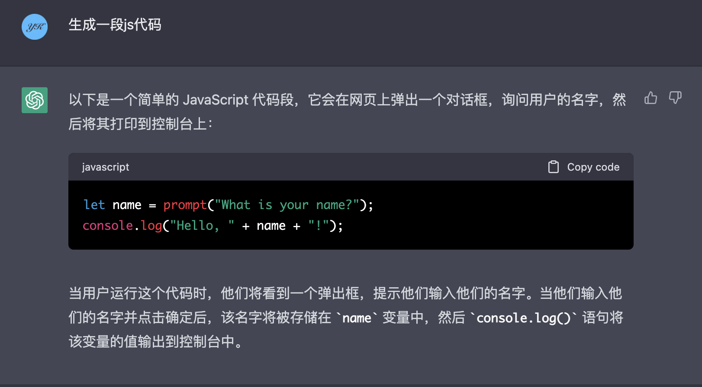
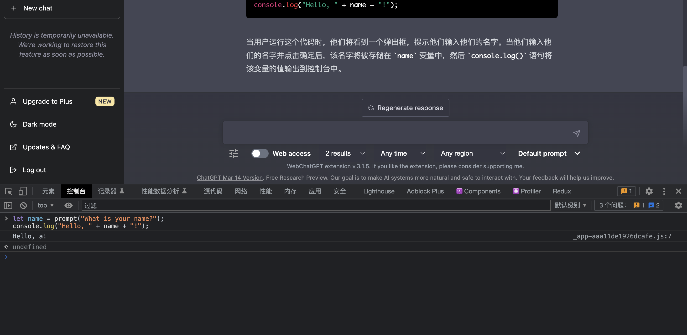
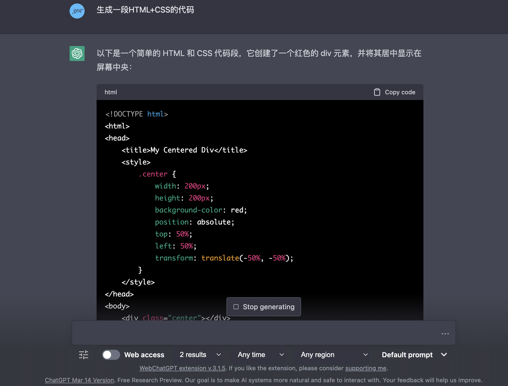
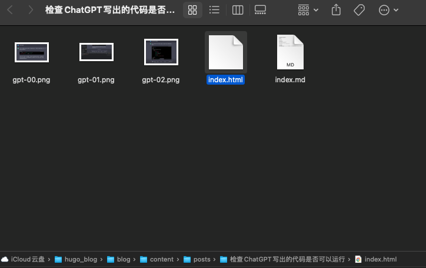
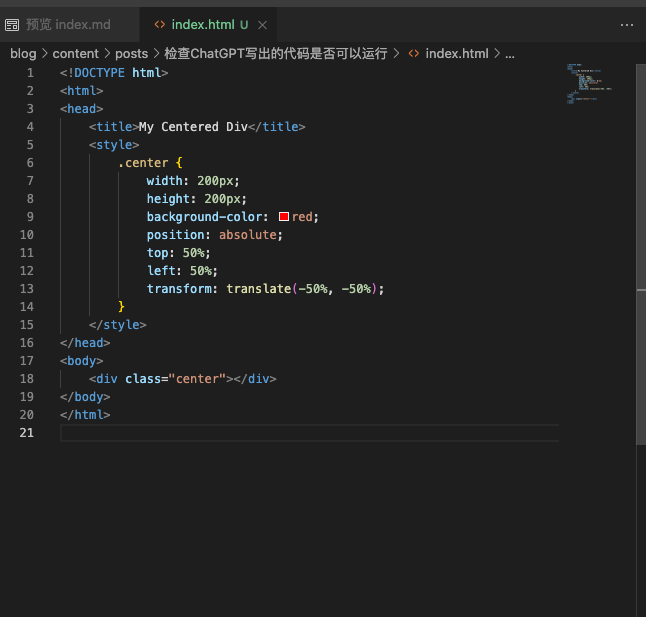
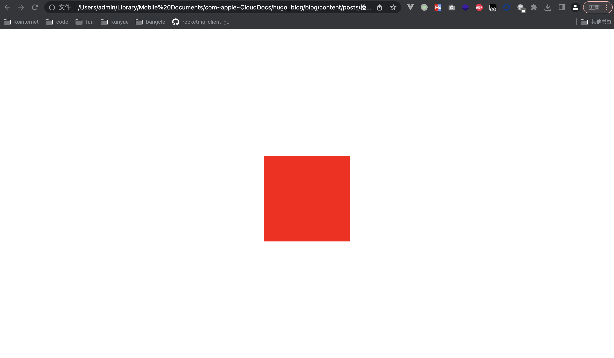

# JS(JavaScript)
首先得到ChatGPT的代码  

```js
let name = prompt("What is your name?");
console.log("Hello, " + name + "!");
```

直接按F12打开开发者工具，点击`控制台`,将代码粘贴到控制台内回车即可  


# HTML+CSS(网页)
  
```html
<!DOCTYPE html>
<html>
<head>
	<title>My Centered Div</title>
	<style>
		.center {
			width: 200px;
			height: 200px;
			background-color: red;
			position: absolute;
			top: 50%;
			left: 50%;
			transform: translate(-50%, -50%);
		}
	</style>
</head>
<body>
	<div class="center"></div>
</body>
</html>

```
将代码复制，然后在自己的电脑上创建一个`index.html`文件，注意后缀名为`.html`,使用文本编辑器或任意可编辑txt文件的工具或ide打开文件,粘贴代码并保存，然后用浏览器打开文件即可  
  
  
